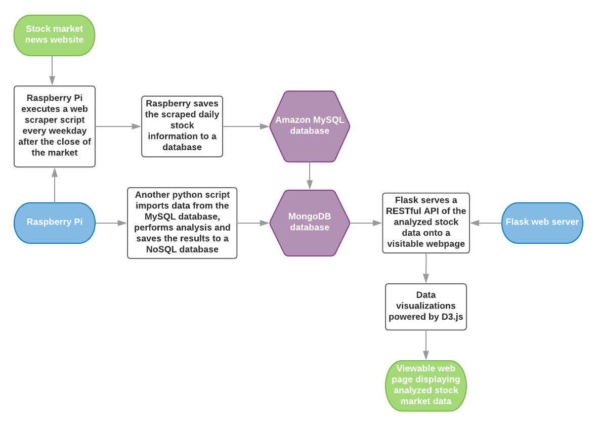

# Stock Analysis App
A python script to scrape the stock quote information for S&amp;P 500 companies each day after closing. Then save that information into a database for later analysis.

## Technologies
- Python (Pandas, Flask)
- SQL & MongoDB
- Javascript (D3.js & JSON)
- RESTful APIs

## App Flowchart

